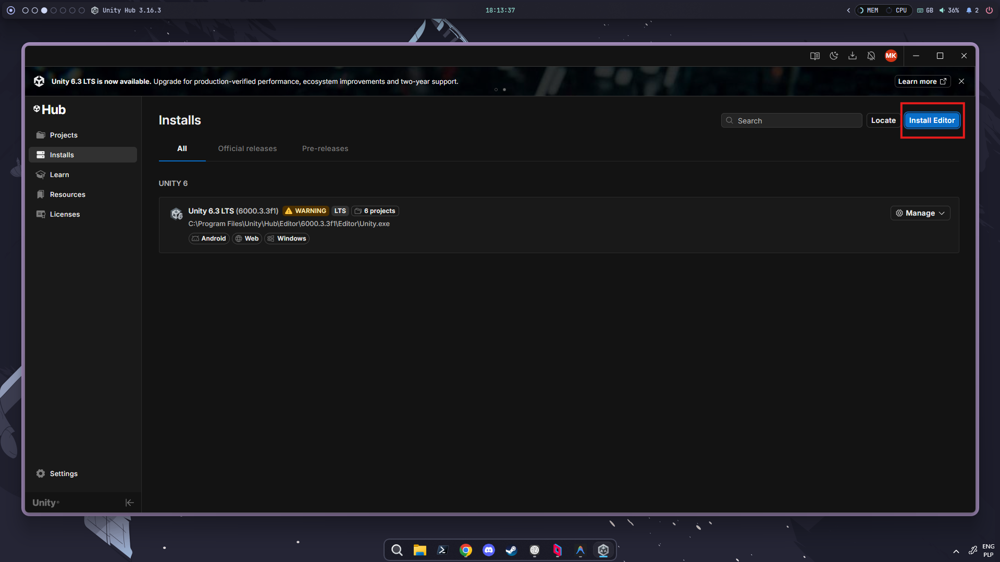
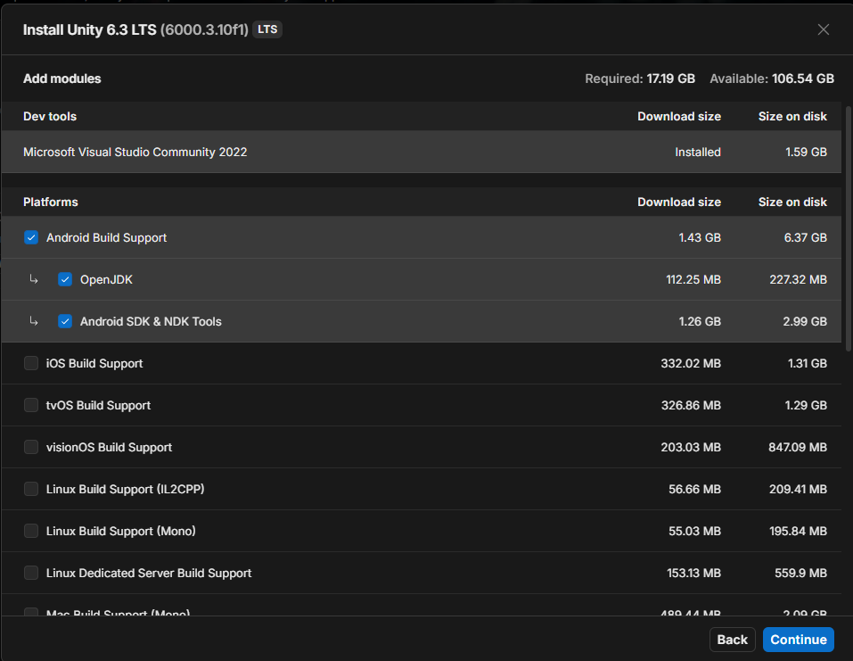

# 01. Introduction and Unity installation

On the first classes we went through the installation of Unity Engine via Unity Hub. In this post I'll guide through this process once again and give you some useful insights on game making in general.

## Setting up the environment

Setting up the environment consists of installing Unity Engine 6.3LTS with correct modules. We will install additional modules that will be later required for VR programming, so we wouldn't need to do set up once again.

### Install Unity Hub

Go to [Unity download page](http://unity.com/download) and get the Unity Hub app. You will need to create an account and accept their ToS. As I recommend you to read the documents you sign, you may read those but there's nothing really worth your special concern hidden in these terms.

### Install Unity Engine

After installing the Hub app, you should open it and navigate to Installations tab and click "Install editor":

When prompted which version to choose, lean to the LTS (long term support) versions as they will be supported for developers for prolonged time and we won't have to switch between versions over the course of these classes. Unity maintainers currently suggest the 6.3 LTS version and we will be using it for now. After choosing the version, you can select the features you want:

The VR goggles mostly run on modified versions of Android OS, you'll need Android Build Tools to be able to compile native apps for this platform. I encourage you to install them now, but we will get to setting them up as we will approach the moment when we switch from learning the basics of Unity to actual VR programming.

### IDE

Unity doesn't include the code editor by itself. Natively, it is shipped with Visual Studio 2022 (violet VS, not the blue VS Code) which is not bad, but it differs a bit from the JetBrains editors you're probably used to. JetBrains offers it's own solution - Rider. The integration is quite easy but needs to be performed for each of the projects individually. It takes just a moment, but it's totally up to you if you prefer the Microsoft tool or the JetBrains one. Here's the [link to the instructions](https://www.jetbrains.com/help/rider/Unity.html#install-rider-editor-package-in-your-unity-project).

### Troubleshooting the install

During our classes we came across some problems with Unity Hub verifying the installed files indefinitely long. Together with one of the students, we've derived a solution. If you're stuck on installing, try to navigate to the install location (by default it should be something like `<DRIVE>:\Program Files\Unity\Hub\Editor\<VERSION>\Editor` on Windows, I have no idea if Mac or Linux cause problems - I don't have a MacOS based device and Linux posed no problems for me) and see if any of the files has been modified in last minutes. If not, try to execute `Unity.exe`. It should fix the problem and automatically move you to the completed install screen in the Hub.

### Closing remarks

That should get you through the installation. Should you have any problems please don't hesitate to contact me at [mikolaj.kikolski@pwr.edu.pl](mailto:mikolaj.kikolski@pwr.edu.pl).

## Assets

When working on your projects, you will need to use 3D objects to populate the scenes. It would not be wise for small teams/single devs to model everything on your own, especially when your CGI course didn't cover good practices of creating game ready assets. I'll talk about this on some of the classes but it's not in the scope of this course. Where does it leave us? We can use models or any other assets someone else has prepared. From my experience, there is a lot of free, good assets available in the internet. In particular, I'll focus on three sources, but you're definitely not limited to them.

### 1. **[Unity Asset Store](https://assetstore.unity.com/)**

Some of the assets there are paid but it's a gold mine of models, shaders, sound systems and even game systems made specifically for Unity. It's integrated into Unity Hub so importing assets into projects is really easy (more about that on next classes).

### 2. **[itch.io](https://itch.io/game-assets/top-sellers/assets-cc0/tag-3d)**

It's an indie dev portal for sharing the assets in pay-as-much-you-want model. It requires a bit more of searching as some assets are made for other game engines, but don't be fooled - over the last year of game development it was my main source of well made low-poly assets and some great sound effects. I'll try to teach you about various file formats and ways to use them in Unity.

### 3. [Polyhaven](https://polyhaven.com/)

It contains great photoscanned textures. I mostly use it for sky textures, as all of the assets there are products of manual photo scanning and using such detailed models in VR applications could lead to making your users vomit violently after a minute of playing a game running at 5 frames per second. Still it's a great resource for skyboxes and textures if you need some high quality ones (or wish to convert them to PSX-style ones).

## Using remote desktop

I'm aware that some of you might have more powerful desktops at home that would run Unity smoothly but your laptops migh lack the computing power. I've tried some solutions and for now [Parsec](https://parsec.app/) proved to be the best way. It offers really low latency. The downside is that you need to set up 2FA method - I prefer OTP (available through FFreeOTP on Android). The site will guide you with the setup. In some time I'll update you on that, because I need to check how building for ADB-connected devices works from remote desktop.
