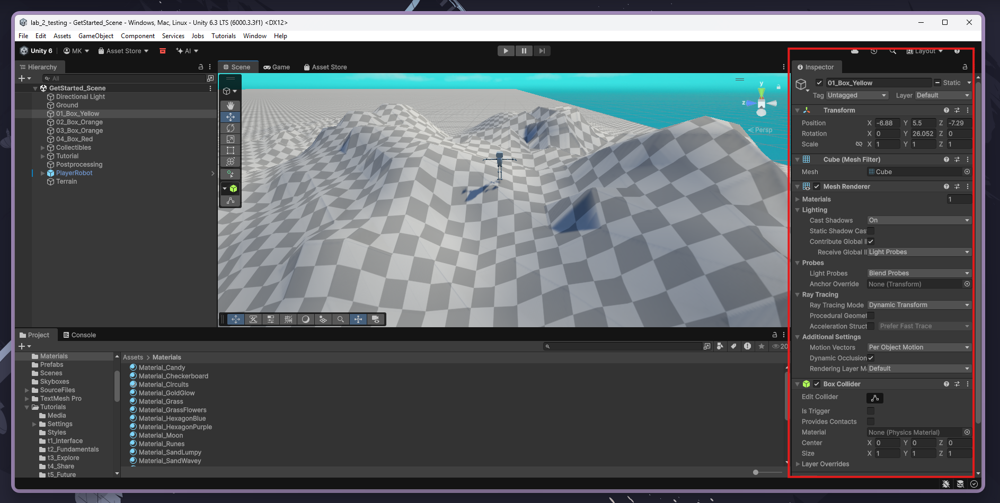
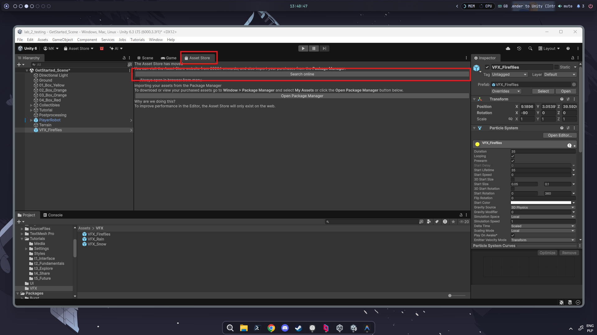
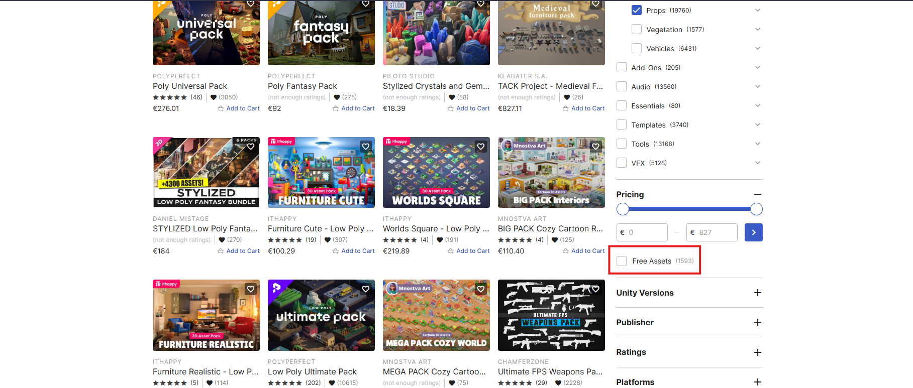
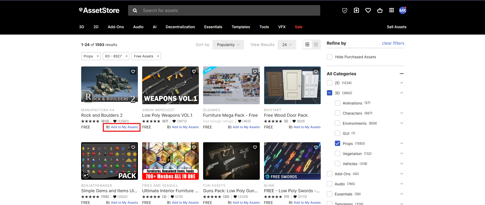
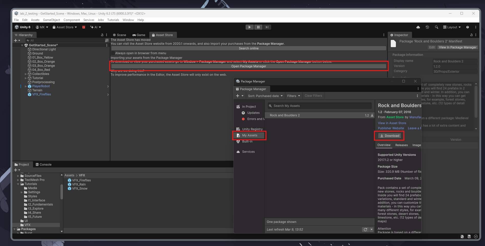
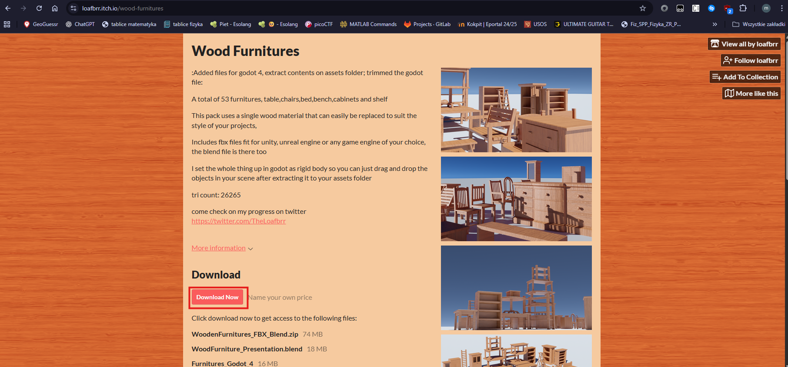
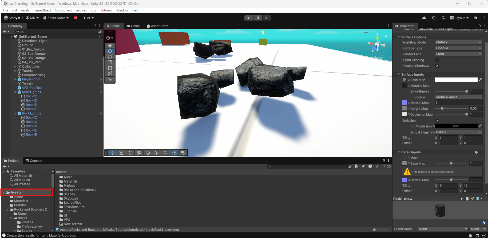
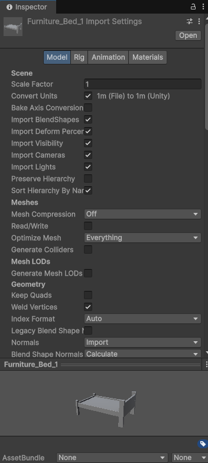

# Lab 2: Unity Scenes and Objects - Creating Scenes with Basic and Imported 3D Components

If you've done the tutorial, you already have some experience with placing basic components. Today, we will extend your with some key skills for creating good scenes.

## Creating scenes

The main way to organize separate parts of games in Unity are **Scenes**. They all have their own separate object tree and separate logic. On further classes we will learn how to switch between them. They've been introduced to improve the organization and most importantly - the performance of the games. Let's say we made game which takes part in a city and most of the action happens on the streets, but there are some rooms in buildings that you need to get into and complete some missions. The rooms must be quite detailed and it would make no sense to keep them loaded in the memory all the time, because they would soon clog up the memory and cause worse performance. That's where the idea of scenes stems from - every room might be a scene of it's own and the city is the main scene. After interacting with the doors of the building in the city we can show our player a loading screen for a moment and load them into the room which is a separate scene. This way everything is organized and performant.

To create a new scene in the project in Unity, we need to click `File > New Scene` or `Ctrl+N`. It will bring us to templates of the scene available in the current project. After selecting a template, a new scene will open in the editor and after saving the project, we will be prompted to name the new scene and select save location.

Later we can proceed in multiple ways. We can work on multiple scenes at once - for example if we have a large map in the game, we can split it to 9 squares forming a 3x3 map. This way, with good scene loading logic we can boost performance. To work on two scenes, we just need to drag the second scene file (saved after creating) to the first scene tree. We also can work on the scenes individually and switch between them as we need. To do so, just double click on the scene you want to open in the **Project** folder.

## Populating scenes

The main building blocks of Scenes in Unity are Game Objects. They are a base for almost any element you experience and they all have one thing in common - they all have a transform **component** which defines their scale, location and rotation. What are the components of Game Objects? Simply speaking they are properties that define a certain object. For example, these are the components of a box from the tutorial:

As you can see, the box GameObject contains data on its geometry, material, shading and collisions but the components are not limited to these properties. For example, when we inserted VFX in the previous tutorial, the components included the particle system definition.

When we imagine a scene in a computer game, the first thing we notice is mostly the geometry. Unity offers us a selection of basic 3D geometrical objects under `GameObject > 3D Object` menu. We can use it to add cubes, spheres, capsules or planes. This menu also contains one interesting tool which is Terrain. Contrary to the previously mentioned options, it allows for sculpting and painting a naturally looking terrain, but we will get back to it during the lab on rendering, because that will be the best lab to showcase the possibilities it enables us with. Problem with the basic geometry will get noticable quite quickly - how can we use these shapes to model more complex objects that will look good? The answer is short - we won't even try. As I've mentioned in the notes to the first classes, we've got two routes - creating models on our own or using premade models. I'll discuss only second option in detail. If you're interested in creating your own models, here's a [good tutorial](https://www.youtube.com/watch?v=KFEb51rinwI) that can guide you through this.

### Importing from Unity Asset Store

That's the native way for Unity. You can access Unity Asset Store link straight from the editor:

Clicking on this link will guide you to the UAS website. On the website you can browse the assets by categories. For this lab you can focus on `3D > Props` as this category contains static models that we can use to populate the scene. After selecting the category, it would be advisable to scroll down the filters to the **Pricing** section and select the free assets:

You can click on any of the assets you like and see the description or additional screenshots. For demonstration purposes I've selected Rock and Boulders 2. You then need to click on **Add to my assets** and accept Terms and Conditions.

Let's go back to the **Asset Store** tab of Unity Editor and launch the package manager. Then you can find your asset and download it to the project:

Once the download has finished you can import your newly aquired objects to the project. You will be able to find your assets in the project window. If you wish to use them as provided, search for the **Prefabs** folder inside your asset folder. You can simply drag them to the scene. If the objects appear pink while they shouldn't don't worry - they're probably build for another render pipeline. In all of our classes we will be using Universal Render Pipeline so the fix is quite easy. Navigate to the `Window > Rendering > Render Pipeline Converter` and initialize the converters. This tool will convert the materials provided with the models to the correct pipeline.

### Importing models from [itch.io](https://itch.io/game-assets/tag-cc0)

You can visit [itch.io/game-assets](https://itch.io/game-assets/tag-cc0) to browse various assets which might be perfect if you can't find the thing you wanted on UAS. For demonstration purpose I've selected a neat pack of wooden furniture. After clicking on the asset, you'll be taken to the asset page where you can see the download button:

This pack wasn't made specifically for Unity, so we will need to tinker a bit. I've downloaded and extracted the files and got 3 folders - FBX, GLTF and Textures. FBX and GLTF are 3D file formats and technically both of them can be imported into Unity Editor, but GLTF requires installing a plugin. After extracting the files, we navigate back to our Editor and look at the **Project tab**. You'll need to right click on **Assets** folder and select **Import new asset**.

This will prompt you to select a file and you should select one of the FBX files you downloaded. Of course you're not limited to FBX - OBJ files which are quite common should work too. After selecting the file, the asset will pop up.

You will notice multiple setting that can be played with but the default mostly work when the assets were packed properly. In my case, the model lacked textures - it was light gray all over. I tried going through with various options and it didn't work which made me conclude that the materials were not packed with the model which sometimes is the case and we need to accept that. Fortunately we got the textures which can be imported similarily to the object and then reattached in the material editor.

You might want to check it out:

- [Supported 3D file types](https://docs.unity3d.com/2020.1/Documentation/Manual/3D-formats.html)
- [glTFast - a tool to import glTF to Unity](https://github.com/atteneder/glTFast)
- [Fixing missing textures after FBX import](https://www.youtube.com/watch?v=1XemiQUKobI)

### Licenses

When using external assets, you're supposed to follow the regulations of the license provided by the author. In itch.io each of the product pages contains a dropdown called **More information** which contains information on the license. You can later check your obligations by googling the license name. Here is some info on the most common ones:

- **CC0 (Public Domain)**: You can do whatever you want - commercial use, no credit required, modify it, etc.
- **CC-BY (Attribution)**: You can use it commercially, but you must give credit to the author in your game’s credits.
- **CC-BY-SA (ShareAlike)**: If you modify the asset, you must release your game or the modified asset under this same license. (Many devs avoid this for commercial projects).
- **CC-BY-NC (Non-Commercial)**: You cannot use these in a game you plan to sell.
- **Own terms (readme file)**: Some of the authors write their own licenses that you should read if the license is not specified.

In Unity Asset Store they have their own types of licenses and they mostly permit you to use the assets in any circumstances after buying them (or downloading a free one).

## Tasks

As a base of our project, we will be using **Get started with Unity** project, the same as last week.

- Find one asset/pack of assets on Unity Asset Store and one outside of it. In the report write shortly what licenses do they use and what do they mean to us as developers **(20%)**
- Create a new scene based on empty 3D preset and build a labirynth using basic 3D objects in unity. Include a few screenshots in the report. **(40%)**
- Switch back to the first scene and add a few assets obtained from both sources. Show it on screenshot. **(40%)**

### What next?

Next lab will be focused on bringing life to the still scenes by coding.