# Lab 4: User Interface Design

During the previous lab you've gained programming skills to bring your scenes to life. The coding part generates and stores a lot of data, some of which needs to be presented to the user. This is where the User Interface comes in. A well designed UI is a key part of any game, as it can significantly improve the user experience. As an introduction, I'd like to invite you for a short tour of the UI evolution in video games.

## UI Examples

When the first video games were created, the UI was very limited, as the games weren't exactly sophisticated. The player was mostly interested in the score, high score and the number of lives (or credits on arcade machines) left. The good example of that is the original Pac-Man ([image source](https://en.wikipedia.org/wiki/Pac-Man)):

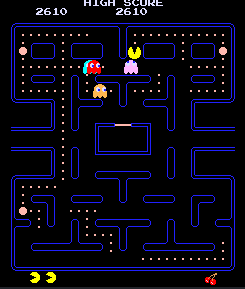

As the games started getting more complex, the UI evolved too. The progress brought more and more data to display, such as health, money, and the current time. The example of that is the original Grand Theft Auto ([image source](https://www.gry-online.pl/gry/grand-theft-auto/zf15b7)):

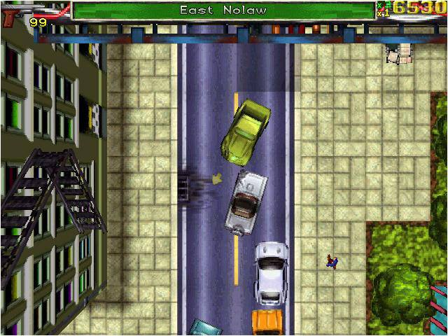

After some time, the UI started evolving in terms of aesthetics too. The developers realized that the UI can be a part of the game world and can contribute to the immersion. The example of that is the original Dead Space, which is set in space and the UI is designed to look like it's projected onto the character's suit ([image source](https://www.gameuidatabase.com/index.php?&set=1&sort=2&tag=80&series=101&scrn=100)):

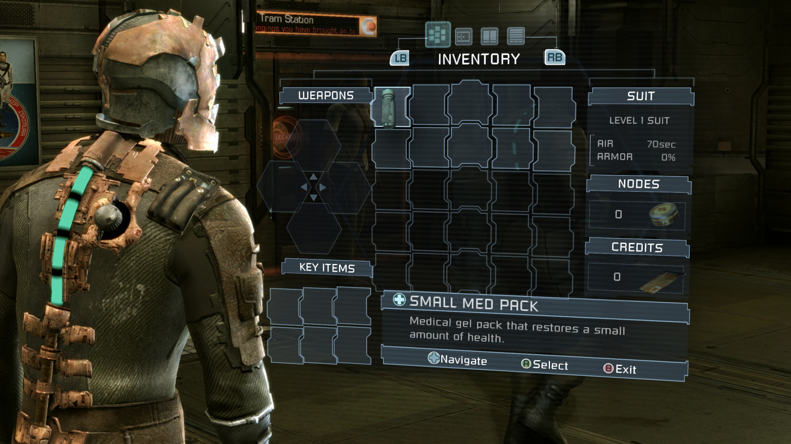

This approach in design is called diegetic UI and it's main goal is to immerse the player in the game world. The opposite of diegetic UI is non-diegetic UI, which is not a part of the game world and is only visible to the player. Does the game need to use the diegetic UI? Definitely not. The diegetic UI isn't always the best choice - it is harder to make it work both technically and artistically. You usually need a really good idea to make it work and not be confusing for the player. After all, the main goal of the UI is to present information to the player in a clear and concise way and even perfect diegetic UI won't make a bad game good (but a bad UI can make a good game unplayable).

I'll show you some other examples of UI design in games to have you inspired for your own projects.

### Deus Ex (2000) ([image source](https://film.org.pl/a/deus-ex-filmowe-gry-komputerowe-115538))

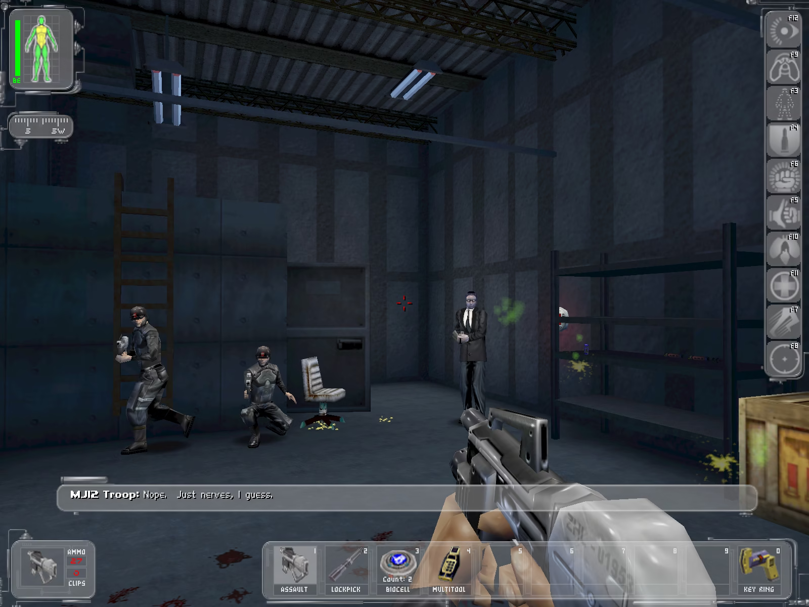

One of my favourite games of all time and perfectly good when it comes to UI design. All the information is presented to the player without cluttering the screen, the shortcuts are clearly visible and the overall design is consistent with the game's atmosphere.

### Don't Starve Together (2014) ([image source](https://hot.game/en/game/Dont-Starve-Together))

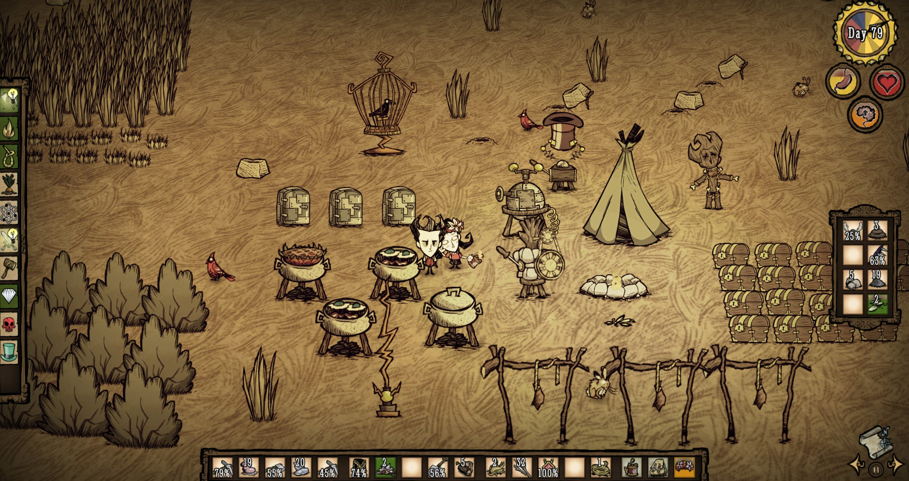

The UI fits the atmosphere perfectly and might seem lacking a bit of information at first glance, but that's where it's beauty lies. It embraces the game's idea of learning to play the game by yourself and discovering things on your own - it deprives the player of exact numbers and lets them infer the state of the game from the visuals.

### Lethal Company (2023) ([image source](https://store.steampowered.com/app/1966720/Lethal_Company?l=polish&t=1701734400))

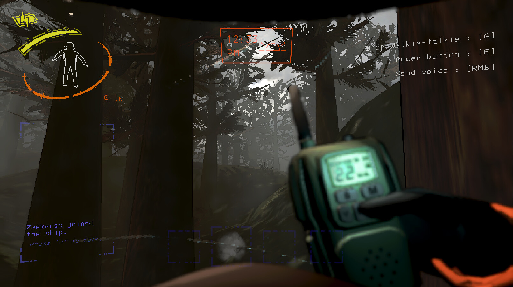

Modern example of diegetic UI at its best.

## Creating UI in Unity

To create UI in Unity, we need to use the **UI** system. It's a separate system from the 3D objects and it's used to create the user interface of the game. The UI system is based on **Canvas** objects. A Canvas is a container for UI elements. It's a 2D plane that is projected onto the screen. I've created a simple scene in Unity that you'll be using during this lab. The scene is specially prepared to bring the game a certain vibe that you'll have to match with your UI design. To explain the mechanics of UI in Unity, I'll use the example of a health bar, which is a common UI element in games.

The basic scene already contains a Canvas which is a place for all the UI elements. I've placed a small reticle in the center of the screen that will help to see where the player is aiming.

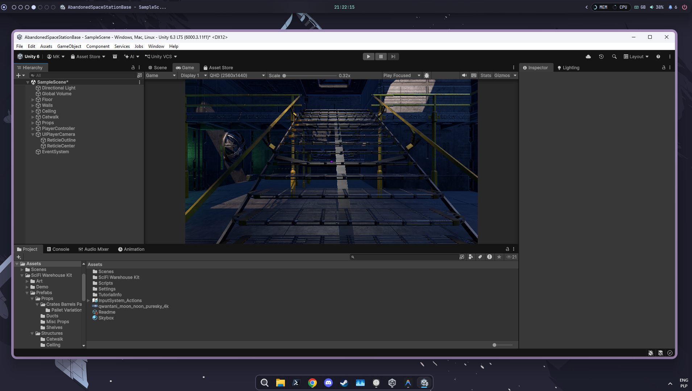

To start I've added `GameObject > UI (Canvas) > Image` to the scene. This has created the main container for our UI elements with a default image of a white square inside. I named my Canvas `UIPlayerCamera`, changed its UI Scale Mode to `Scale With Screen Size`, set Screen Match Mode to `Expand` and set the reference resolution to 1920x1080, as it's the most common resolution for PC games. The Image got renamed to `ReticleCenter`. I decided to leave the reticle as a square but I changed its size and color. Aditionally I duplicated the reticle image and used it to create a frame around the center reticle for improved contrast. Please note that the elements on the top of hierarchy are displayed as the bottom layer - that's why the `ReticleCenter` is below the `ReticleOutline`.

First step I took for designing my health bar was taking a screenshot of the game and importing it to GIMP. This step is important for real UI design as it lets you plan the whole layout easily. Moreover, if you're aiming for some sort of more complex shapes in your UI, you can create them in GIMP and then import them to Unity as images which can be used as UI elements. After a while of tinkering, I came up with this design:

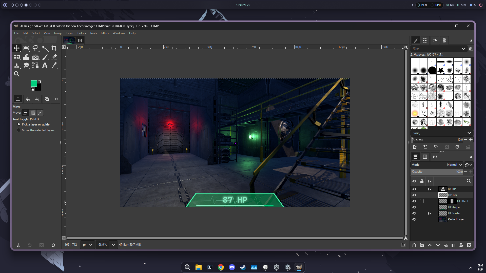

*Spoiler: I didn't end up implementing the ECG animation in the final version of the UI. It was a nice idea but it was too much work to implement it properly for the sake of this tutorial.*

To host our UI elements responsible for the health bar, in the main canvas I've created a new empty object called `HPContainer`.

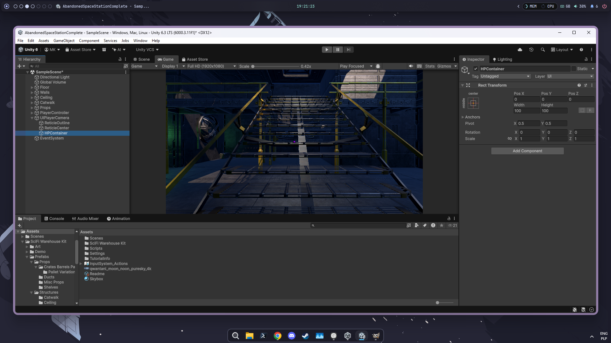

You may notice that the Empty object already received a **Rect Transform** component. This is the equivalent of the **Transform** component for UI elements. It defines the position, size and rotation of the UI element in the 2D space of the Canvas. I used this component to set the anchor and positioning of the `HPContainer` to the center of the full stretch with alignment to the middle (bottom-rightmost option in the anchor dropdown menu).

Now back to the design from GIMP. I've exported two images - `UI-Frame.png` and `UI-BG.png` that will help me build the health bar base. If you wish to follow my steps, you should export them as white images with transparent background. That will allow us to color them later in Unity. As you can notice, the `UI-Frame.png` has a slight glow to it which was achieved by using the Drop Shadow effect in GIMP with white shadow color. When importing the images to Unity, make sure to set their **Texture Type** to **Sprite (2D and UI)**. Also make sure to set **Sprite Mode** to **Single** and Alpha Source to **Input Texture Alpha**.

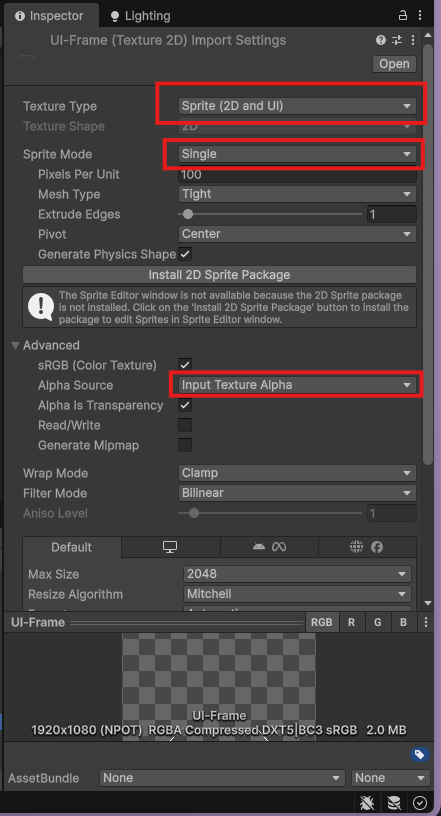

You will see the small arrows appearing on the left of the imported assets after applying the new import settings. Clicking on them will reveal the generated sprites. 

In our `HPContainer` object we will add two Image objects. The first one will be responsible for the glowing frame of the health bar panel and the second one for the background. I named them `Frame` and `Background` respectively. If you exported the sprites from GIMP in 1920x1080 resolution, you can set them up as shown below:

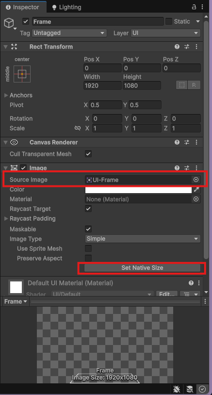

You can also use the color selector to finally add the white components some color. After setting it up for both of the images I needed to add the health bar itself. I added a new Image object alongside `Frame` and `Background` and named it `BarBase`.

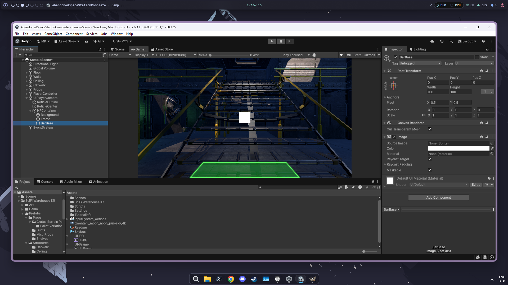

But wait, this doesn't look like a health bar yet. I've decided to anchor and move it to the centre-bottom of the screen and then I played around with the size until it looked right.

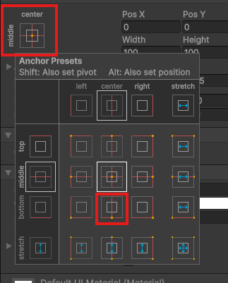
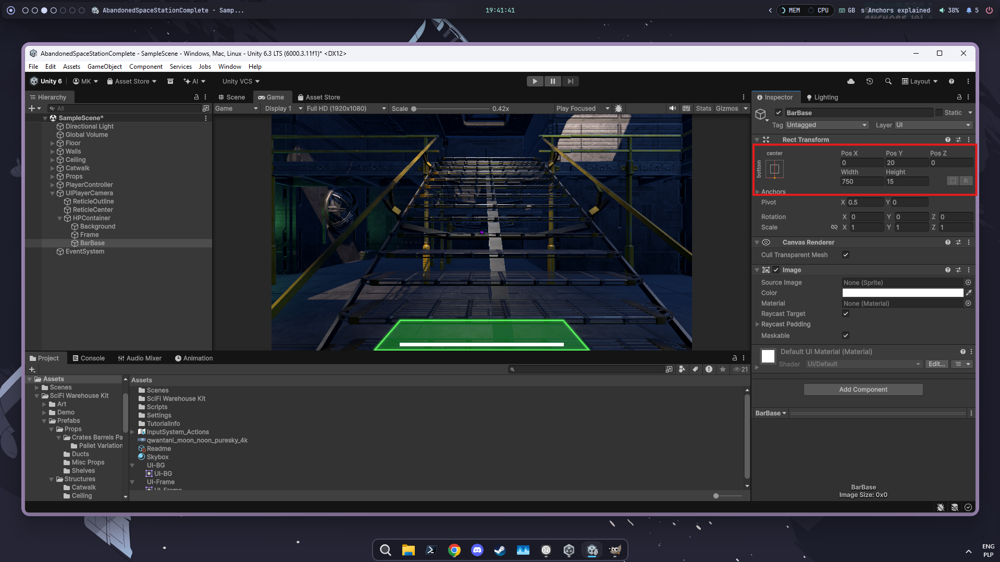

This way of manipulating the UI elements is a way to go if you're aiming for simpler shapes in your UI - no need to export images from GIMP, just scaling and moving the basic rectangles and circles will do the trick. You can also try searching for some free UI assets on Unity Asset Store for your further projects.

Generally there are two ways of making a progress bar (or any other dynamic bar for that matter) in Unity. The first one is to use the Image component with the **Filled** fill type. You won't be dealing with two separate images but rather one image that will be filled with color. Unfortunately, I'm stubborn and when creating the tutorial, I've made up the second way - using two images, one for the background and one for the foreground. To proceed my way, you'll need to add a new Image as a child of `BarBase` and name it `BarFill`. The `BarFill` image should be anchored to the left-center of the `BarBase` and its width will be controlled by the HP of the player.

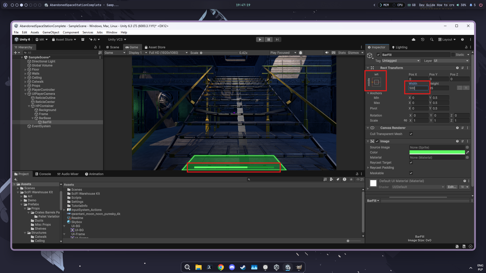

Continuing with the design of the health bar, we now need to add the text elements. Find yourself a font you like and import it to the project. You can download fonts from sites like [Google Fonts](https://fonts.google.com/). After importing the font, you'll need to create Font Asset. You can access this option in `Window > TextMeshPro > Font Asset Creator`. You'll need to select your imported font:

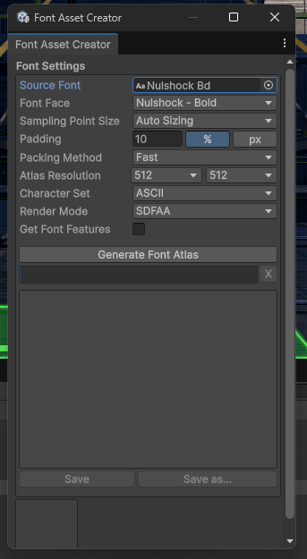

After creating the font asset, we can actually add the text elements to the UI. On the way you might get prompted to import the TextMeshPro Essentials. Do it, it's the current way of rendering the text in Unity. I've added a single element as a child of `HPContainer` and named it `HPText`. I've set its anchor to the center-bottom of the `HPContainer` and played around with the size and position until it looked right. Then I selected the font asset I've just created and set the text to "100 HP".

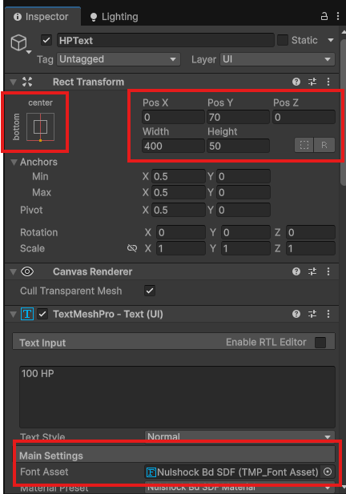

Further steps included setting the color and for my case making sure that the text was centered.

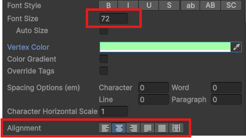

Now, we've created the static UI elements. The next step is to make them dynamic. Beside dynamic health bar and the text, I wanted to implement the idea taken from Left 4 Dead and probably many other games - the bar will be colored differently depending on the amount of HP the player has. We will start with attaching a MonoBehavior script to the `HPContainer` object. I named it `HealthUI`. The HP is updated in the `PlayerController` script, so we'll need to get a reference to it in the `HealthUI` script. To update certain elements of the UI, we'll need to get references to them as well. After setting up the fields I got:

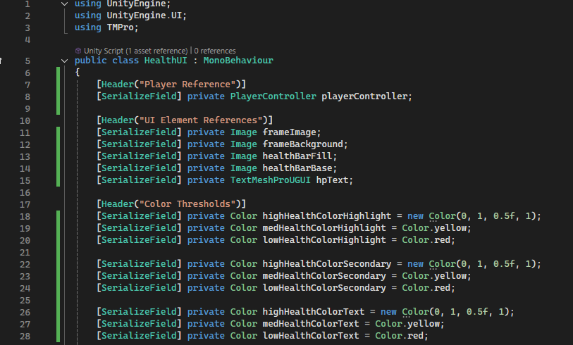

The color fields are the addition I mentioned earlier - I've set them up according to my idea and added `SerializeField` attribute to them so they're customizable from the Inspector. I've created one method that will handle all the operations as they're quite easy and I didn't want to clutter the code with multiple methods.

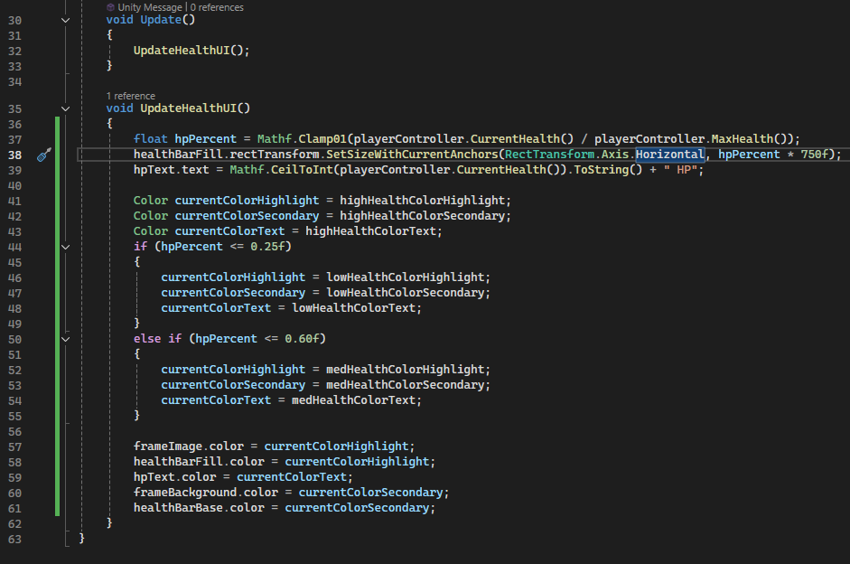

We obtain health values from the `PlayerController` script and use them to update the health bar and the text. The health bar is updated by changing the width of the `BarFill` image. The text is updated by changing the text of the `HPText` image. The only tricky part here was the line 38 and it's all due to my design choice of using two images for the health bar instead of one. I needed to dive into the Unity documentation to figure out how to do it properly and came up with the method `SetSizeWithCurrentAnchors`. It requires us to specify the axis along which we want to scale the image (in this case horizontal) and the size we want to scale it to. I used the percentage of maximum health as the scaling factor and hardcoded the full size of the HP Bar. Of course, the size of the bar could have been read from the object properties and I strongly encourage you to do it in your projects.

The thresholds in the color setting part of the script could have also been exposed to the Inspector but for demonstration purposes they're hardcoded. 

The last thing we need to do is to set the correct references in the inspector:

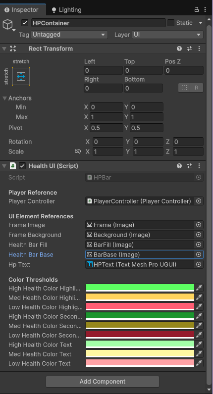

And that's it! Now we have a working health bar that updates dynamically and changes color depending on the health of the player.

But this is not all. The game has interaction system implemented for some of the objects in the scene. The code is in the project and you should take a look at it to understand how it works, beacause this will be a thing you'll need to implement in your assignment.

## Required UI Elements

1. Health Bar
2. Interaction Prompt - each of the interactions should display a prompt if player is looking at the object from certain distance. Checking the distance is already implemented and it prints to the debug log. You'll need to implement the UI part.
3. Interaction Timer - if we detect that player is holding the interaction button, we should display a timer showing the progress of the interaction. It can be a circle or a bar.
4. Interaction notifications - when the interaction is completed, we should display a notification saying that the interaction was completed. The interaction system already has them implemented and printed to the debug log.
5. Death Screen - when the player dies, we should display a death screen with the option to restart the game. The additional tutorial on interaction buttons is available on e-portal.

## Tasks

1. Make a project of your own UI for this scene. The project can be done in any graphical software and could be a polished project for a reference or a quick draft of object placement (10%)
2. Implement the Health Bar (20%)
3. Implement the Interaction Prompt (10%)
4. Implement the Interaction Timer (20%)
5. Implement the Interaction Notifications (20%)
6. Implement the Death Screen (20%)